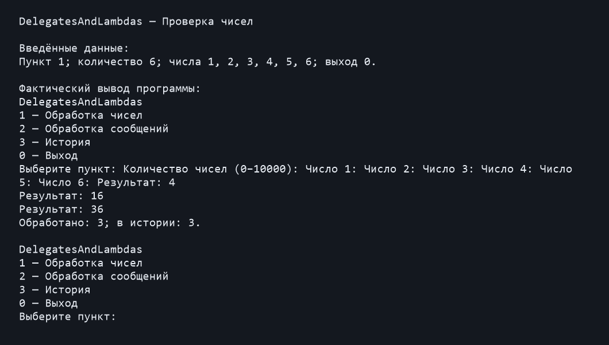
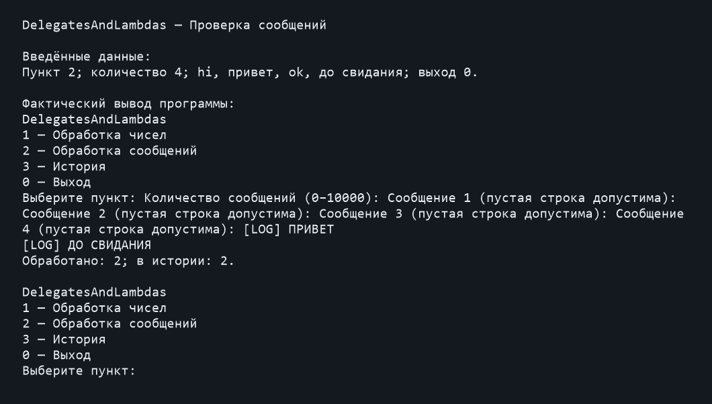
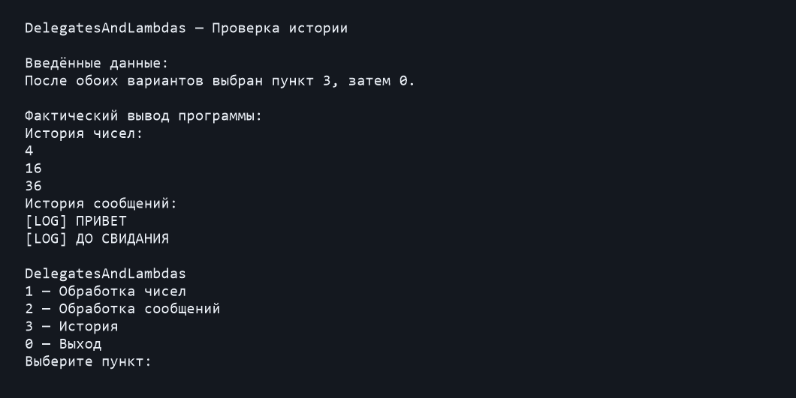

# DelegatesAndLambdas

Простой консольный проект C# для Visual Studio 2026 и .NET 10.

## Запуск
Распакуйте архив, откройте DelegatesAndLambdas.sln и нажмите Ctrl+F5.
Из терминала: dotnet run --project DelegatesAndLambdas.csproj

## Работа программы
1 — обработка чисел. Введите количество, затем числа по одному.
Фильтр Func<int, bool> оставляет чётные числа.
Преобразование Func<int, int> возводит их в квадрат.
Два Action<int>, объединённые через +=, выводят и сохраняют результат.

2 — обработка сообщений. Введите количество, затем сообщения по одному.
Пустые строки допустимы. Func<string, bool> оставляет строки длиннее 3 символов.
Func<string, string> переводит их в верхний регистр и добавляет "[LOG] ".
Два Action<string>, объединённые через +=, выводят и сохраняют результат.

3 — просмотр истории обоих вариантов. История хранится в отдельных списках
до закрытия программы, затем очищается.
0 — выход.

Некорректный числовой ввод запрашивается повторно.
Количество элементов: от 0 до 10000.
Если квадрат не помещается в int, число пропускается с сообщением.
Пробелы в сообщениях сохраняются и учитываются в длине.

## Примеры
Числа 1, 2, 3, 4, 5, 6 дают результаты 4, 16, 36.
Сообщения "hi", "привет", "ok", "до свидания" дают:
[LOG] ПРИВЕТ
[LOG] ДО СВИДАНИЯ

## Файлы
Program.cs — меню.
ConsoleInput.cs — ввод и проверка.
NumberProcessor.cs — обработка чисел.
MessageProcessor.cs — обработка сообщений.
## Проверка работы

Ниже — изображения фактического вывода программы при запуске на проверочных
данных. Это визуализация сохранённого вывода, а не снимки окна приложения.
Введённые данные указаны отдельно, поскольку при автоматическом запуске
консоль не повторяет ввод.

### Обработка чисел
Пункт 1, количество 6, числа 1, 2, 3, 4, 5, 6.
Ожидаемый и полученный результат: 4, 16, 36. В истории 3 элемента.

### Обработка сообщений
Пункт 2, количество 4, сообщения hi, привет, ok, до свидания.
Ожидаемый и полученный результат: [LOG] ПРИВЕТ и [LOG] ДО СВИДАНИЯ.
В истории 2 элемента.

### История
После обработки обоих наборов выбран пункт 3.
История содержит числа 4, 16, 36 и два преобразованных сообщения.

